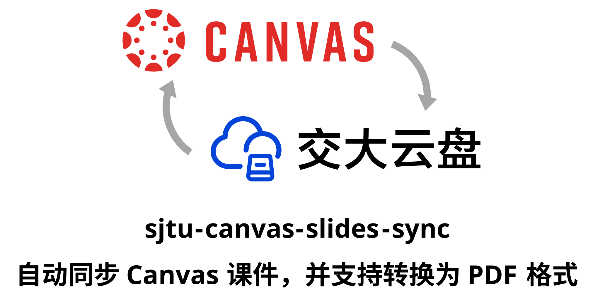

   
   
  
  

本项目支持将 [SJTU Canvas](https://oc.sjtu.edu.cn/) 的文件定期同步到 [交大云盘](https://pan.sjtu.edu.cn/)。结合 [TboxWebdav](https://github.com/1357310795/TboxWebdav/) 可实现“本地”打开 Canvas 文件，且不额外占用本地空间。此外，还支持将 `.pptx` 等格式自动转换为 PDF，方便在笔记软件中阅读和标注。

## 使用
1. 点击右上角 `Fork`，然后点击 `Create fork`。
2. （推荐）打开上方 `Settings`，滑动到最下方，点击 `Leave fork network` 并确认。刷新页面后，在相邻位置点击 `Change visibility` 并确认。
3. 在设置页面左侧 `Secrets and variables -> Actions` 中，按下表点击 `New repository secret` 添加密钥。

| Name | Secret |
| - | - |
| CANVAS_TOKEN | 打开 [Canvas 设置页面](https://oc.sjtu.edu.cn/profile/settings)，点击 `创建新访问许可证`，随意填写用途，点击 `生成令牌`，复制令牌并填入 |
| SMH_USER_TOKEN | 打开 [交大云盘](https://pan.sjtu.edu.cn/)，按下 `F12` 或 `Ctrl+Shift+I` 打开开发者工具，在 `应用 -> Cookie` 中找到 `USER_TOKEN`，双击对应的 `值` 一栏后复制并填入 |
| JAAuthCookie | （可选）如不想使用 SMH_USER_TOKEN，可使用 JAAuthCookie 代替。打开 [jAccount](https://jaccount.sjtu.edu.cn/jaccount/)，按下 `F12` 或 `Ctrl+Shift+I` 打开开发者工具，在 `应用 -> Cookie` 中找到 `JAAuthCookie`，双击对应的 `值` 一栏后复制并填入。使用此方法无需定期更新 Cookie |

4. 点击上方 `Actions`，选择 `Canvas Auto Sync`，并点击 `Enable workflow`（可参考 [GitHub 文档](https://docs.github.com/en/actions/how-tos/manage-workflow-runs/disable-and-enable-workflows)）。

> [!NOTE]
> 尽管本项目在日志输出中对 `CANVAS_TOKEN`、`SMH_USER_TOKEN`、`JAAuthCookie` 等敏感信息做掩码处理，这些令牌泄露的风险仍然存在。因此，推荐按上述第 2 步将仓库设为私密。

## 配置项

### 定时执行规则

通过 [`sync.yml`](.github/workflows/sync.yml) 中的 `on.schedule.cron` 可配置定时执行规则。请参考 [GitHub 文档](https://docs.github.com/en/actions/reference/workflows-and-actions/workflow-syntax#onschedule) 或 [crontab.guru](https://crontab.guru/)。

### 手动执行配置

手动执行：点击上方 `Actions`，选择 `Canvas Auto Sync`，点击 `Run workflow`，按 [手动执行配置](#手动执行配置) 的说明设置参数后点击 `Run workflow`。

手动执行时，可配置以下参数：

| 配置项 | 说明 | 默认值 | 示例 |
| - | - | - | - |
| `sync_all` | 是否同步所有学期（默认仅同步最新学期） | `false` | `true` / `false` |
| `max_file_size` | 最大同步文件大小（单位：MB，`0` 表示无限制） | `1024` | `0` 等 |

### 定时执行配置

定时执行时的固定配置（在 [`sync.yml`](.github/workflows/sync.yml) 的 `Run Sync` 步骤中编辑）：

| 配置项 | 说明 | 默认设置 |
| - | - | - |
| `CONVERT_PPT_TO_PDF` | 是否将 PPT 转换为 PDF | `true` |
| `SAVE_ROOT` | 云盘中的保存根目录 | `Canvas Files` |
| `MAX_FILE_SIZE` | 最大同步文件大小（单位：MB，0 表示无限制） | `1024` |
| `FILE_EXTENSIONS` | 同步的文件后缀（逗号分隔） | `.ppt,.pptx,.pdf` |
| `CONVERT_EXTENSIONS` | 自动转换为 PDF 的文件后缀（逗号分隔） | `.ppt,.pptx` |
| `timeout-minutes` | 单次运行超时时间（单位：分钟） | `60` |

启用 PPT 转换为 PDF 后，转换后的 PDF 文件会以 `原文件名.from-原后缀.pdf` 的格式上传，以避免与 Canvas 中原有的同名 PDF 冲突。

## 注意事项
- 连续 60 天无文件更新后，此 workflow 可能被 GitHub 自动停用。可参考上文 [使用](#使用) 的第 4 步重新启用。
- 关于用量：按 1.5 分钟/工作日和 30 分钟/GB 粗略估算，GitHub 月免费额度（2000 分钟）可同步 60GB+ 文件。Canvas 每门课程默认空间约为 1000MB。本 workflow 可设置最大文件大小（默认 1GB）和单次运行超时时间（默认 60 分钟）。可在 [Billing Overview](https://github.com/settings/billing) 查看当前用量，在 [Budgets](https://github.com/settings/billing/budgets) 设置付费上限（一般默认为 `$0`，即不会产生费用）。

## TODO

- [ ] 支持同步文件夹下的文件
- [ ] 手动执行时设置更长的超时时间

## 参考资料

- https://github.com/1357310795/TboxWebdav